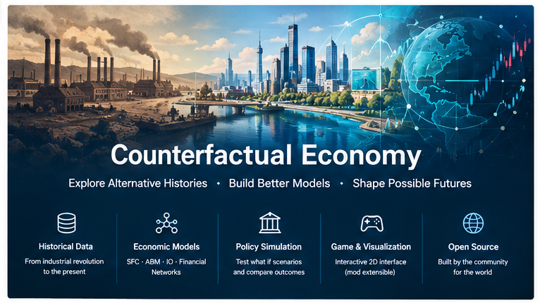

<div align="center">



# Counterfactual Economy

### 开源的反事实经济模拟平台：探索另一种历史、另一套政策，以及不同的未来可能性。

</div>

> **如果当时政府做了不同的经济政策，世界会怎样？**

Counterfactual Economy 希望把历史经济数据、经济理论、家庭与企业行为、银行与金融网络、政府政策以及不确定性放进一个透明、可扩展、可验证的模拟系统。

它最终可以同时成为：

- **历史经济经营模拟游戏**；
- **开放的经济研究与政策实验平台**。

## 为什么做这个项目？

历史只发生了一次，但当时的经济系统并不只有一条可能路径。

政府可以选择不同的利率政策，监管机构可以采用不同的房贷标准，一个国家可以改变税收、财政、贸易、产业政策或资本管制。

项目想研究的问题是：

> **如果改变一个具体的政策或制度规则，其他条件在明确假设下保持尽可能可比，经济系统可能沿着哪些不同路径演化？**

这里不追求一个所谓“正确的另一种历史”。反事实结果依赖数据、模型结构、参数、预期、制度与假设。

真正需要做到的是：**把这些假设公开，让结果可以复现、比较、质疑和验证。**

## 第一个旗舰实验：2008

第一个验证任务是：**2000—2008 年美国金融危机挑战**。

> 能否只使用每个历史时点上当时真正可获得的信息，在2008年全球金融危机完全爆发之前，识别出金融系统正在累积的脆弱性？

我们不要求模型准确说出某一天、某一家机构必然失败，也不把单一预测当成科学结论。

我们真正想测试的是：**危机前的数据是否能形成可解释的风险信号，以及不同政策选择是否会改变结果的概率分布。**

→ **[完整挑战说明](docs/2008_CHALLENGE.md)**  
→ **[公开招募帖](docs/2008_CHALLENGE_CALL.md)**

## 项目架构

```text
历史 / 实时经济数据
          │
          ▼
     数据标准化层
  数据版本 / 修订 / 单位
          │
          ▼
   ┌───────────────────┐
   │    经济模拟内核    │
   │                   │
   │ SFC + ABM + IO +  │
   │     金融网络       │
   └─────────┬─────────┘
             │
             ▼
      经济理论 / 政策模块
             │
             ▼
       校准 / 验证 / 蒙特卡洛
             │
             ▼
        反事实模拟引擎
             │
        ┌────┴────┐
        ▼         ▼
      游戏 UI   研究 UI
```

## 核心原则

**先模型，后画面。** 计算资源优先用于经济模拟，而不是高精度3D画面。

**使用机制，而不是“主义模式”。** 不同经济理论应表现为可测试的机制和假设，而不是简单的意识形态阵营。

**尊重历史信息集。** 模拟2005年时，尽可能使用2005年当时可获得的信息，而不是今天修订后的全部数据。

**真实历史是锚点，不是强制答案。** 游戏中的另一种历史不应被系统偷偷改回真实历史。

**不确定性必须公开。** 结果可以是概率分布、范围和多种情景，而不是伪装成精确答案的单一路径。

**每个研究结果都应该可以复现。** 数据版本、参数、模型版本、假设和随机种子都应该被记录。

**允许失败。** 一个证明模型“不行”的实验，同样是有价值的贡献。

## 长期目标

从工业革命以后开始，逐渐增加：

- 国家与多国经济系统；
- 人口、产业、能源和贸易网络；
- 家庭、企业、银行、政府等 Agent；
- 金融危机与资产负债表传染机制；
- IMF、OECD、BIS、ECB、FRED 等公共数据适配器；
- 当前经济环境的情景模拟；
- 可插拔的经济理论与政策模块；
- Mod 扩展体系；
- 2D 历史经营游戏与研究分析界面。

项目不是要制造一个“预言未来”的机器，而是希望建立一个：

> **用计算方法探索可能经济世界的实验室。**

## 当前状态

**阶段：概念 / 研究设计**

目前仓库重点是：项目愿景、研究问题、技术架构、数据原则、2008挑战、贡献流程和路线图。

第一阶段不会直接做全球经济模拟，而是先完成一个可复现的 **美国2000—2008经济与金融系统原型**。

## 如何参与

欢迎来自以下领域的人参与：

**宏观经济学 · 经济史 · 计算经济学 · Agent-Based Modeling · 存量—流量一致性 · 金融经济学 · 量化金融 · 数据工程 · 科学计算 · 2D游戏开发 · 可视化 · AI研究**

不需要认同目前的所有设计。提出反例、替代方案、失败实验和不同模型，同样欢迎。

→ **[贡献指南](CONTRIBUTING.md)**  
→ **[Good First Issues](docs/good-first-issues/README.md)**  
→ **[研究问题](RESEARCH.md)**  
→ **[数据规范](DATA.md)**  
→ **[2008 Challenge](docs/2008_CHALLENGE.md)**
